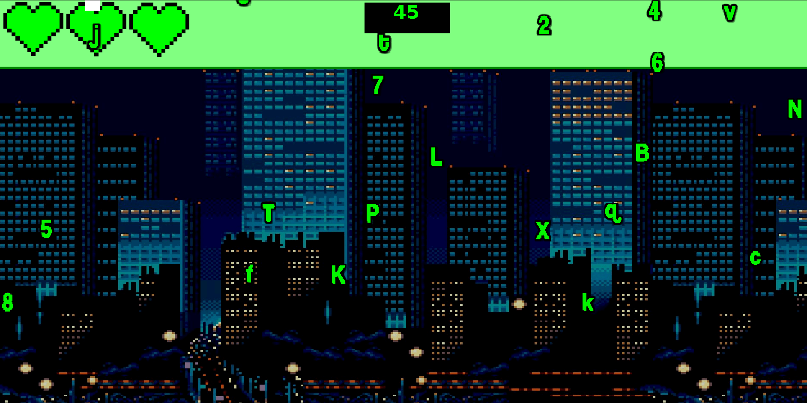

## The Typix: The Game

El juego tiene un estilo didáctico y su objetivo es enseñar y mejorar las distintas técnicas de mecanografía del usuario. Para ello, se introducen una serie de niveles basados en la estructura básica del aprendizaje, escalando la dificultad a medida que progresamos por los diferentes niveles. 

## Gameplay

El gameplay es sencillo y directo, diseñado para que cualquier usuario de cualquier edad pueda prácticar de una forma entretenida. Al empezar un nivel, caerán una serie de letras desde la parte superior de la pantalla, las cuales debemos presionar antes de que lleguen a la zona inferior para que desaparezcan. Si no somos capaces de teclear la letra en cuestión, perderemos una vida de las 3 que tenemos, y tras 3 fallos habremos perdido la partida. 

## Estilo

La temática del juego está basada en la película "The Matrix", con una historia, escenarios y música relacionados.

## Diseño

El juego está hecho integramente con Java, la librería Swing y una GUI personalizada hecha por el IES Hlanz. Para guardar y seleccionar los niveles, usa la librería "gson" de Google, leyendo y escribiendo sobre un archivo JSON el cual admite hasta 9 partidas guardadas a la vez. 

"The Typix" ha sido realizado como proyecto académico y presenta carencias de 'QoL' en su jugabilidad, como por ejemplo en su resolución, que está diseñada para ser 1920x1080, y cualquier otro parámetro nos generará errores de posición de elementos.  

